# Baseline experiment

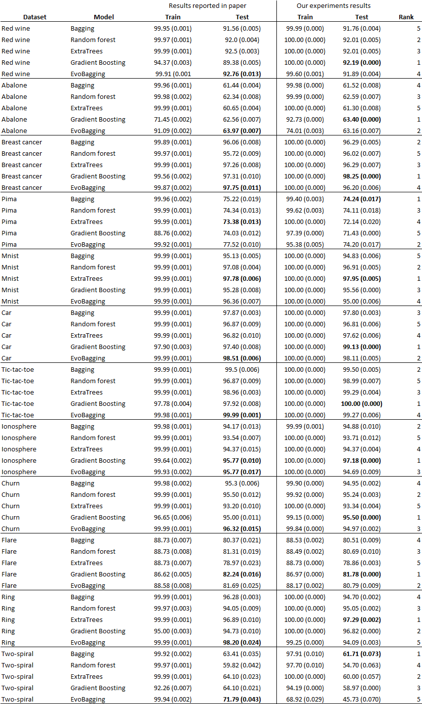

# Optimal parameters resulting from grid search

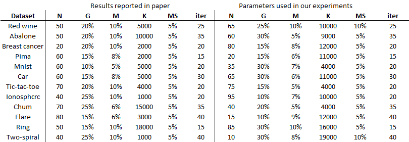

# Bias reduction between first and last iteration across all datasets

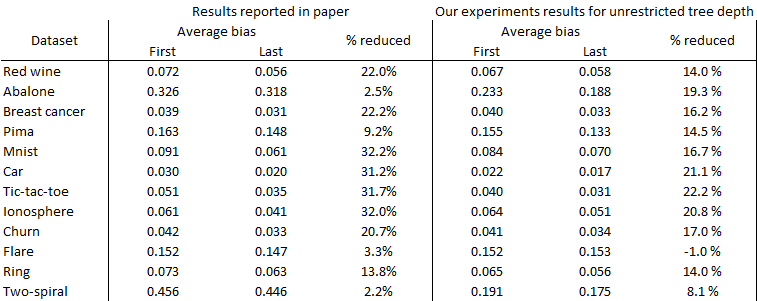

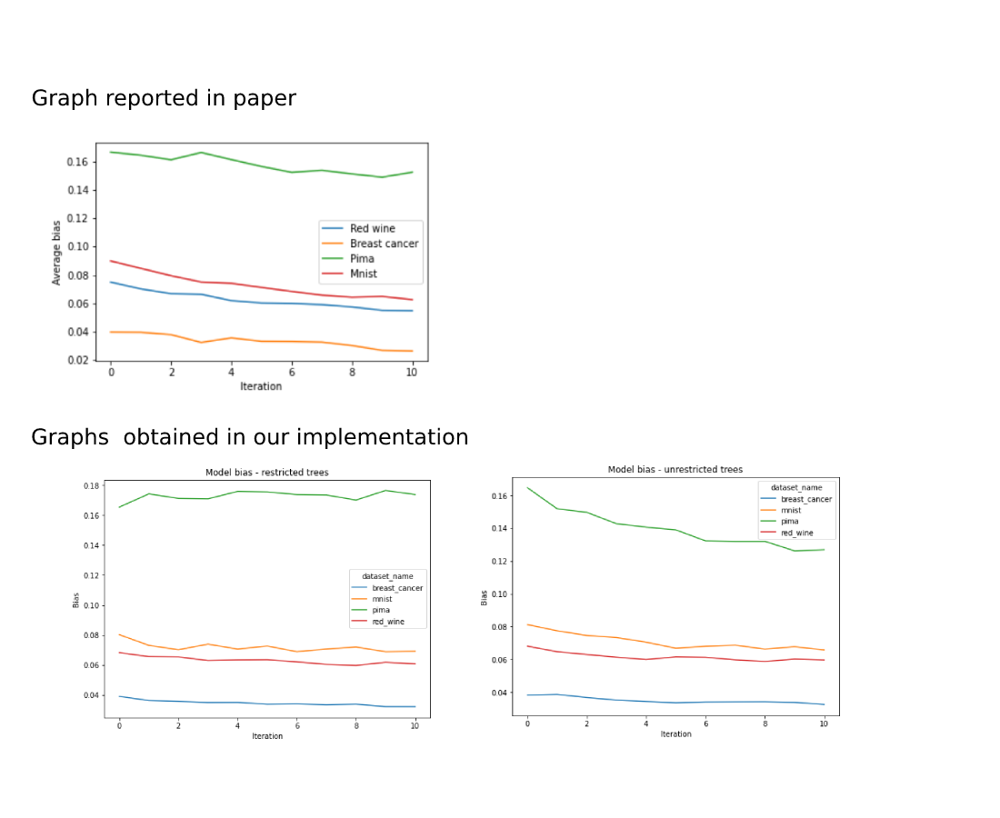

# Influence of hyperparameters

### Maximum bag size S

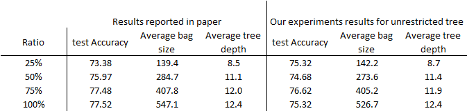

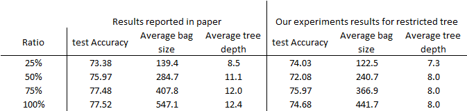

### Generation gap G

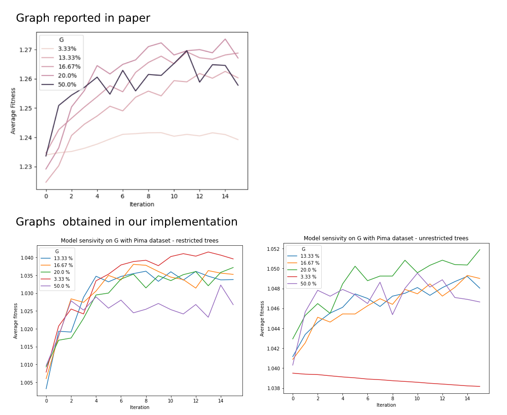

### Number of mutated bags M

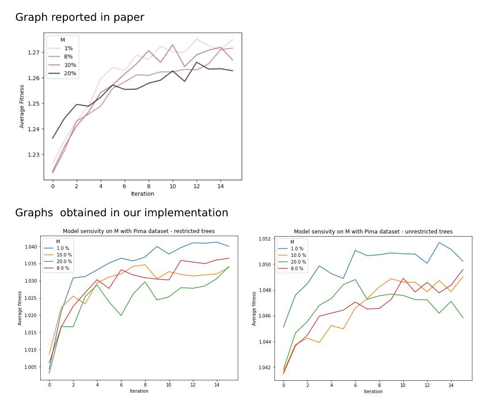

### Mutation size

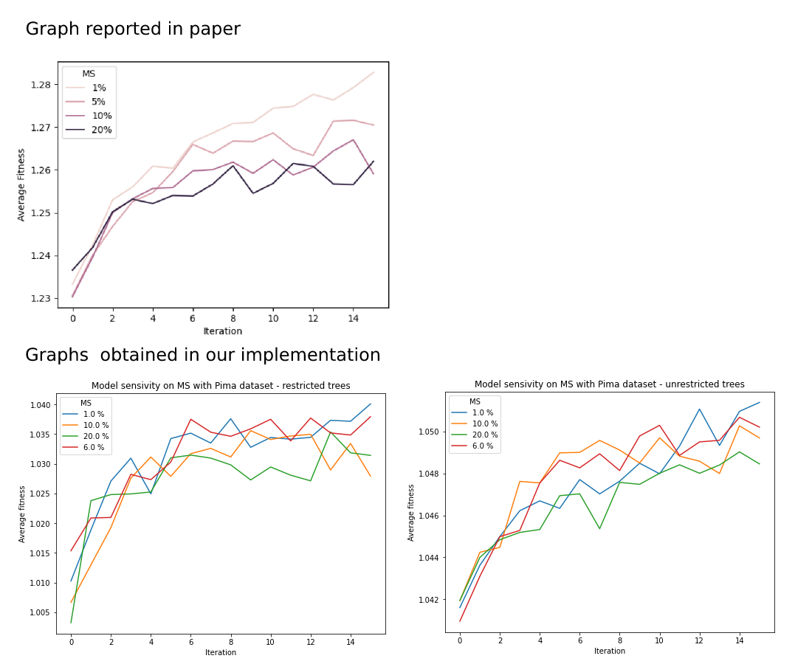

### Bag size

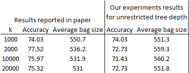

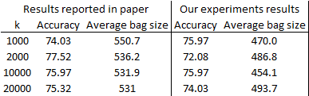

# Voting rule experiment

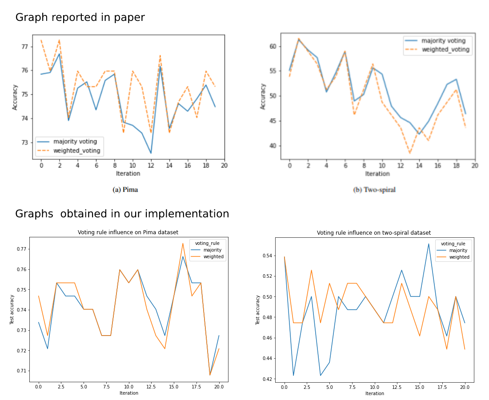

# Diversity across learners

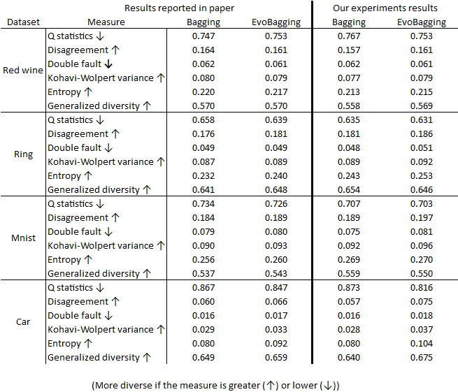

# nbit parity problem

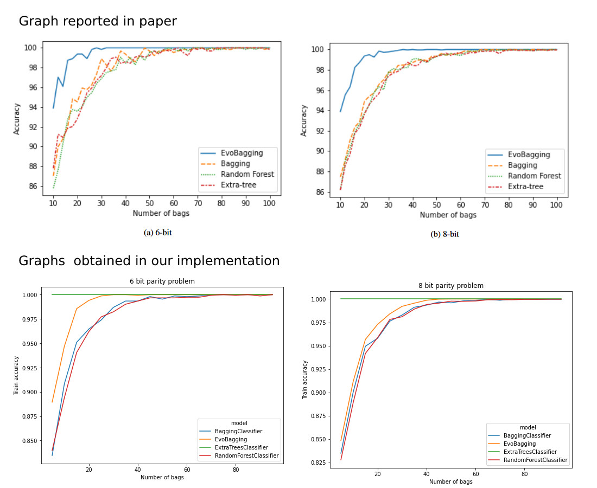